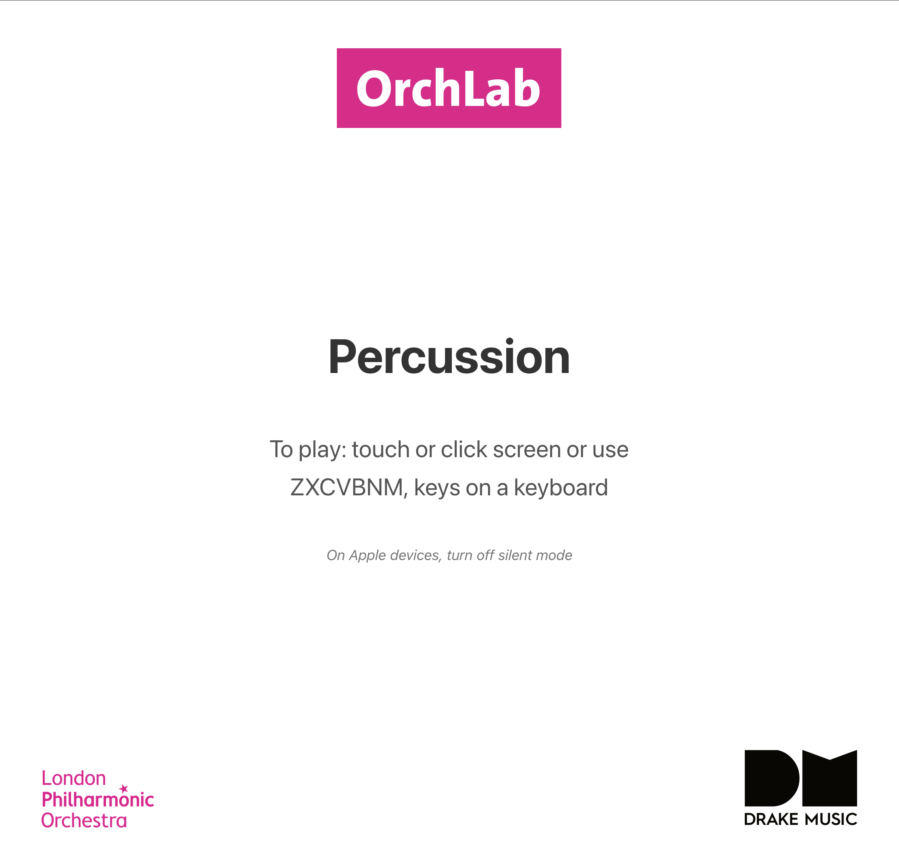
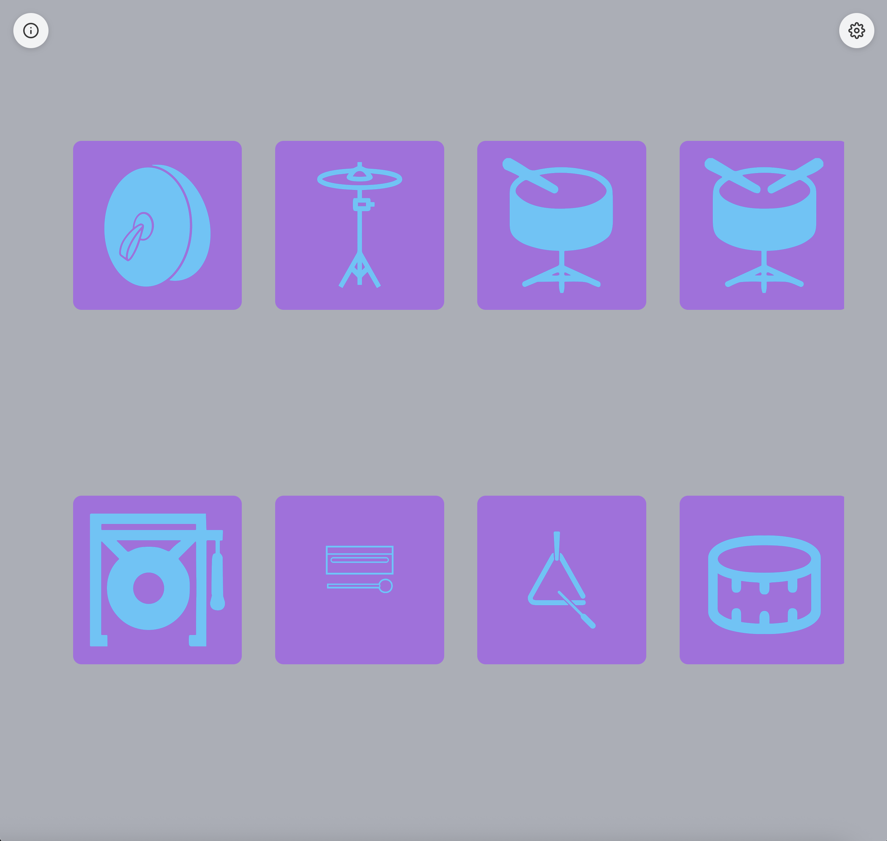
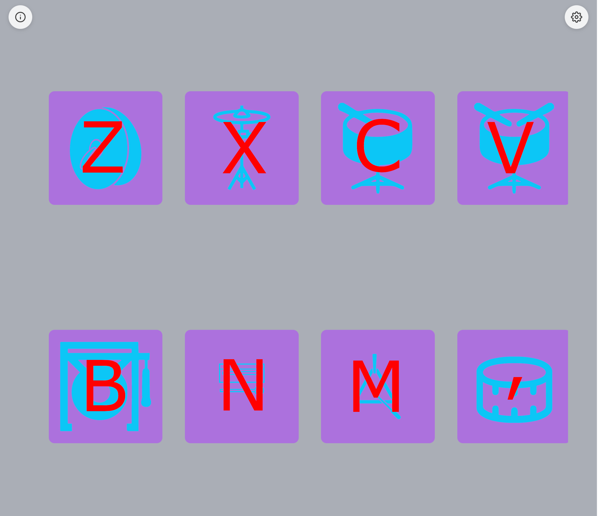
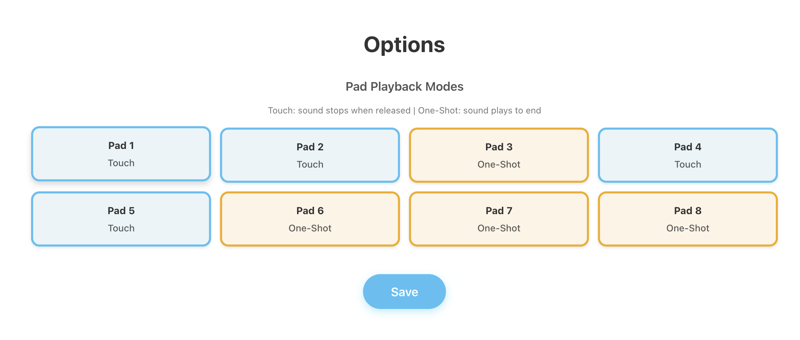
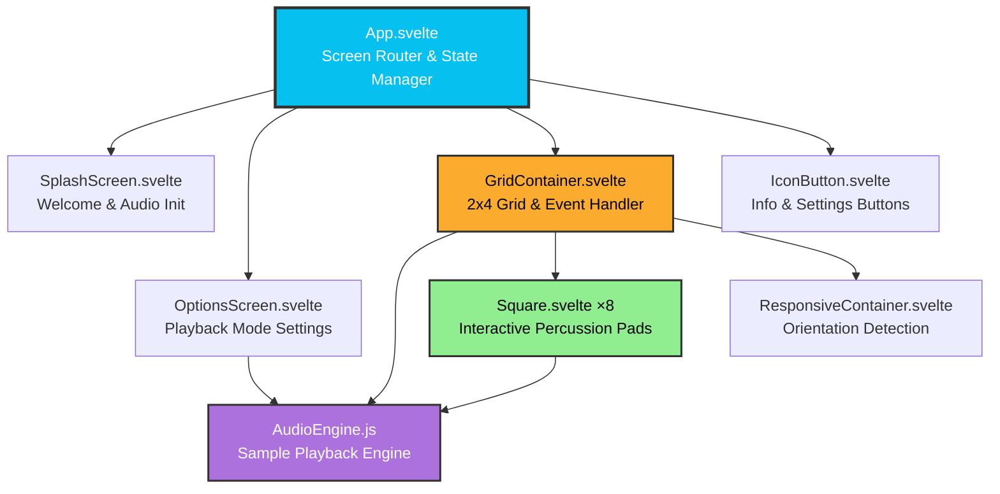

# Percussion - Musical Touch Interface

A responsive web-based percussion instrument that transforms your screen into a playable grid of 8 percussion sounds. Each square triggers a different percussion instrument, creating an intuitive and accessible way to make music through touch, mouse, or keyboard.

## Features

- **8 Percussion Instruments**: Cymbals, cymbal roll, snare hit, snare roll, gong, woodblock, triangle, and tom
- **Configurable Playback Modes**: 
  - Touch mode: Sound stops when you release
  - One-shot mode: Sound plays to completion
- **Responsive Design**: Adapts seamlessly to portrait and landscape orientations
- **Multiple Input Methods**:
  - Touch/tap on mobile devices
  - Mouse clicks on desktop
  - Keyboard controls (Z, X, C, V, B, N, M, ,)
- **iOS 9+ Compatible**: Extensively tested and optimized for older iOS devices

## Percussion Sounds

1. **Cymbals** (Pad 1) - Pair of cymbals crash
2. **Cymbal Roll** (Pad 2) - Sustained cymbal roll
3. **Snare Hit** (Pad 3) - Sharp snare drum hit
4. **Snare Roll** (Pad 4) - Snare drum roll
5. **Gong** (Pad 5) - Deep gong strike
6. **Woodblock** (Pad 6) - Bright woodblock tap
7. **Triangle** (Pad 7) - Clear triangle ring
8. **Tom** (Pad 8) - Tom drum hit

## Usage

### 1. **Launch**: Click/tap anywhere on the splash screen to begin or press any key on the keyboard.



### 2. **Play**: 
   - Touch or click the percussion pads to play sounds
   - Use keyboard keys (Z-X-C-V-B-N-M-,) for the 8 percussion instruments
   - Press 'P' key for panic stop (stops all notes)




*Keyboard mapping for the 8 percussion pads*

### 3. **Configure**: Click the settings icon to customize playback modes
   - **Touch Mode**: Sound stops when you release the pad (default for pads 1, 2, 4, 5)
   - **One-Shot Mode**: Sound plays to completion regardless of release (default for pads 3, 6, 7, 8)



## How It Works

The app uses the Web Audio API to play pre-recorded percussion samples in real-time. Each square in the grid corresponds to a different percussion instrument, with configurable playback behavior to suit different playing styles.

## Development

### Prerequisites

- Node.js (v14 or higher)
- npm or pnpm

### Installation
```bash
# Clone the repository
git clone https://github.com/gawainhewitt/soundmakers_percussion.git
cd soundmakers_percussion

# Install dependencies
npm install

# Start development server
npm run dev
```

Visit `http://localhost:5173` in your browser.

### Building for Production
```bash
# Build the app
npm run build

# Preview the production build
npm run preview
```

The built files will be in the `dist/` directory, ready for deployment.

### Testing on Mobile Devices

To test the production build on physical mobile devices (especially useful for iOS testing):
```bash
# Build the app first
npm run build

# Serve the production build on your local network
npm run serve
```

The app will be available at your local IP address (e.g., `http://192.168.1.x:3000`). You can access this URL from any device on the same network.

**Note**: This is particularly important for testing iOS-specific features like audio initialization and touch handling, which behave differently in development vs production builds.

## iOS Compatibility Notes

This app has been carefully optimized for iOS 9+ devices:

- **Polyfills**: Core-js and regenerator-runtime ensure ES6+ features work on older browsers
- **Audio Unlocking**: Implements iOS-specific audio context initialization
- **Touch Handling**: Advanced touch tracking prevents stuck notes and handles multi-touch scenarios
- **Viewport Management**: Comprehensive fixes for iOS viewport issues when switching apps
- **Zoom Prevention**: Disables pinch-zoom and double-tap-zoom for a native app feel

## Project Structure
```
├── src/
│   ├── App.svelte              # Main app component & screen routing
│   ├── main.js                 # Entry point with iOS fixes
│   ├── app.css                 # Global styles
│   └── lib/
│       ├── AudioEngine.js      # Web Audio API sample playback
│       ├── Square.svelte       # Individual playable percussion pad
│       ├── GridContainer.svelte # 2x4 grid layout & event handling
│       ├── OptionsScreen.svelte # Playback mode configuration
│       ├── SplashScreen.svelte # Welcome/instructions screen
│       ├── IconButton.svelte   # Reusable icon button component
│       └── ResponsiveContainer.svelte # Orientation handling
├── public/
│   ├── sounds/                 # 8 percussion sound samples (MP3)
│   ├── images/                 # Logos, icons, and pad graphics
│   └── polyfills/              # iOS 9+ compatibility scripts
└── index.html                  # Entry HTML with polyfill loading
```

## Architecture


*Component hierarchy and data flow*

## Technologies Used

- **Svelte 5**: Modern, reactive UI framework
- **Vite**: Fast build tool and dev server
- **Web Audio API**: Real-time audio sample playback
- **Vite Legacy Plugin**: Automatic transpilation and polyfills for older browsers

### Design Decisions

**Static Site Delivery**: This app is built as a static site (vanilla Vite + Svelte) rather than using SvelteKit. This architectural choice provides:

- **Maximum Compatibility**: Works seamlessly on older devices and browsers (iOS 9+)
- **Lightweight Bundle**: Minimal JavaScript footprint for faster loading on slower devices
- **Simple Deployment**: Can be deployed to any static hosting service without server-side requirements
- **Reduced Complexity**: No SSR overhead or routing complexity for a single-page application

This approach prioritizes accessibility and performance, ensuring the app works reliably across the widest possible range of devices and network conditions.

## Troubleshooting

**No sound on iOS**: Ensure silent mode is turned off. The audio context requires an initial user interaction (handled by the splash screen).

**Stuck notes**: Press the 'P' key to trigger panic stop, or use the window blur detection which automatically stops all notes when switching apps.

**Layout issues after app switching**: The app includes comprehensive viewport reset logic that should handle this automatically.

## Contributing

Contributions are welcome! Please feel free to submit a Pull Request.

## License

See [LICENSE](LICENSE) file for details.

## Credits

Developed in collaboration with:
- [**OrchLab**](https://orchlab.org/)
- [**London Philharmonic Orchestra (LPO)**](https://lpo.org.uk/)
- [**Drake Music**](https://www.drakemusic.org/)
- [**Gawain Hewitt**](https://gawainhewitt.co.uk/)